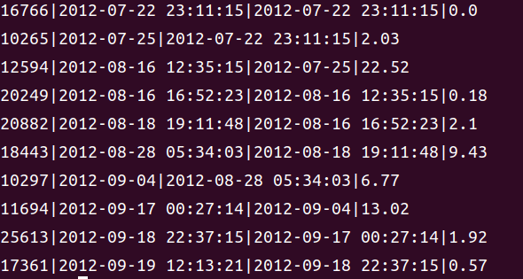

# 作业1
## Q1
```sql
SELECT DISTINCT ShipName, SUBSTR(ShipName, 1,INSTR(ShipName, '-') - 1) as first_hypen
FROM 'Order' 
WHERE ShipName LIKE "%-%" 
ORDER BY ShipName;
```

## Q2
```sql
SELECT Id, ShipCountry, 
       CASE 
              WHEN ShipCountry IN ('USA', 'Mexico','Canada')
              THEN 'NorthAmerica'
              ELSE 'OtherPlace'
       END
FROM 'Order'
WHERE Id >= 15445
ORDER BY Id 
LIMIT 20;
```

## Q3
```sql
SELECT CompanyName, round(delayCnt * 100.0 / cnt, 2) 
FROM (
      SELECT ShipVia, COUNT(*) AS cnt 
      FROM 'Order'
      GROUP BY ShipVia
     ) AS totalCnt
INNER JOIN (
            SELECT ShipVia, COUNT(*) AS delaycnt 
            FROM 'Order'
            WHERE ShippedDate > RequiredDate 
            GROUP BY ShipVia
           ) AS delayCnt
          ON totalCnt.ShipVia = delayCnt.ShipVia
INNER JOIN Shipper on totalCnt.ShipVia = Shipper.Id
ORDER BY pct DESC;
```

## Q4
```sql
select CategoryName, count(*) as cnt, ROUND(AVG(UnitPrice),2),MIN(UnitPrice),MAX(UnitPrice),SUM(UnitsOnOrder)
from Product, Category
where Product.CategoryId = Category.Id
group by CategoryName
having cnt > 10;

```

## Q5
```sql
SELECT proname, CompanyName, ContactName
FROM (
      SELECT proname, min(OrderDate), CompanyName, ContactName
      FROM (
            SELECT Id AS pid, ProductName AS proname 
            FROM Product 
            WHERE Discontinued != 0
           ) as discontinued
      INNER JOIN OrderDetail on ProductId = pid
      INNER JOIN 'Order' on 'Order'.Id = OrderDetail.OrderId
      INNER JOIN Customer on CustomerId = Customer.Id
      GROUP BY pid
    )
ORDER BY proname ASC;
```

## Q6
```sql
SELECT
     Id, OrderDate, PrevOrderDate, ROUND(julianday(OrderDate) - julianday(PrevOrderDate), 2)
FROM (
     SELECT Id, OrderDate, LAG(OrderDate, 1, OrderDate) OVER (ORDER BY OrderDate ASC) AS PrevOrderDate
     FROM 'Order' 
     WHERE CustomerId = 'BLONP'
     ORDER BY OrderDate ASC
     LIMIT 10
);
```

## Q7
```sql
SELECT IFNULL(t2.CompanyName, "MISSING_NAME"), t1.CustomerId, ROUND(t1.s, 2)
FROM
(
    SELECT a.CustomerId, SUM(b.Quantity * b.UnitPrice) s,NTILE(4) OVER (ORDER BY SUM(b.Quantity * b.UnitPrice) ASC) bkt
    FROM 'Order' a
        JOIN OrderDetail b ON a.Id = b.OrderId
    GROUP BY a.CustomerId
) t1
LEFT JOIN Customer t2 ON t2.Id = t1.customerId
WHERE t1.bkt = 1;
```

## Q8
```sql
SELECT RegionDescription, FirstName, LastName, bday
FROM 
(
  SELECT RegionId AS rid, MAX(Employee.Birthdate) AS bday 
  FROM Employee
    INNER JOIN EmployeeTerritory ON Employee.Id = EmployeeTerritory.EmployeeId
    INNER JOIN Territory ON TerritoryId = Territory.Id
  GROUP BY RegionId
)
INNER JOIN (
            SELECT FirstName, LastName, Birthdate, RegionId, EmployeeId
            FROM Employee
              INNER JOIN EmployeeTerritory ON Employee.Id = EmployeeTerritory.EmployeeId
              INNER JOIN Territory ON TerritoryId = Territory.Id
           )
           ON Birthdate = bday AND rid = RegionId
INNER JOIN Region ON Region.Id = RegionId
GROUP BY EmployeeId
ORDER BY rid;
```
